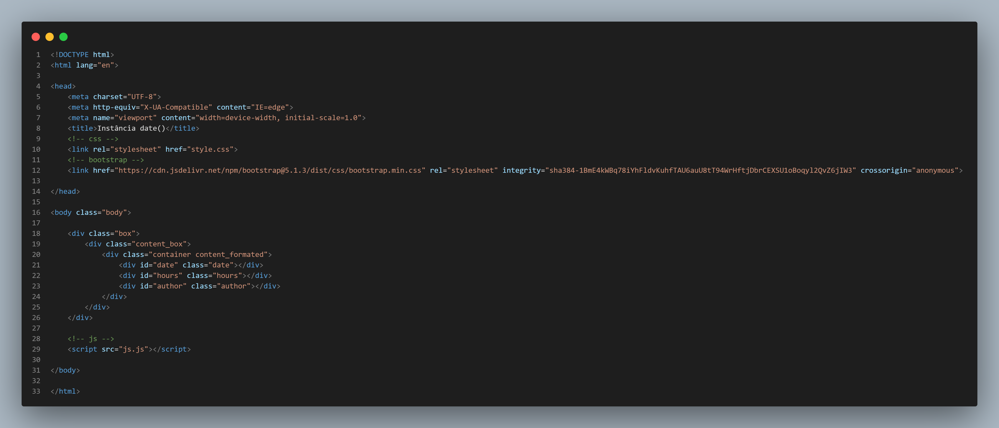
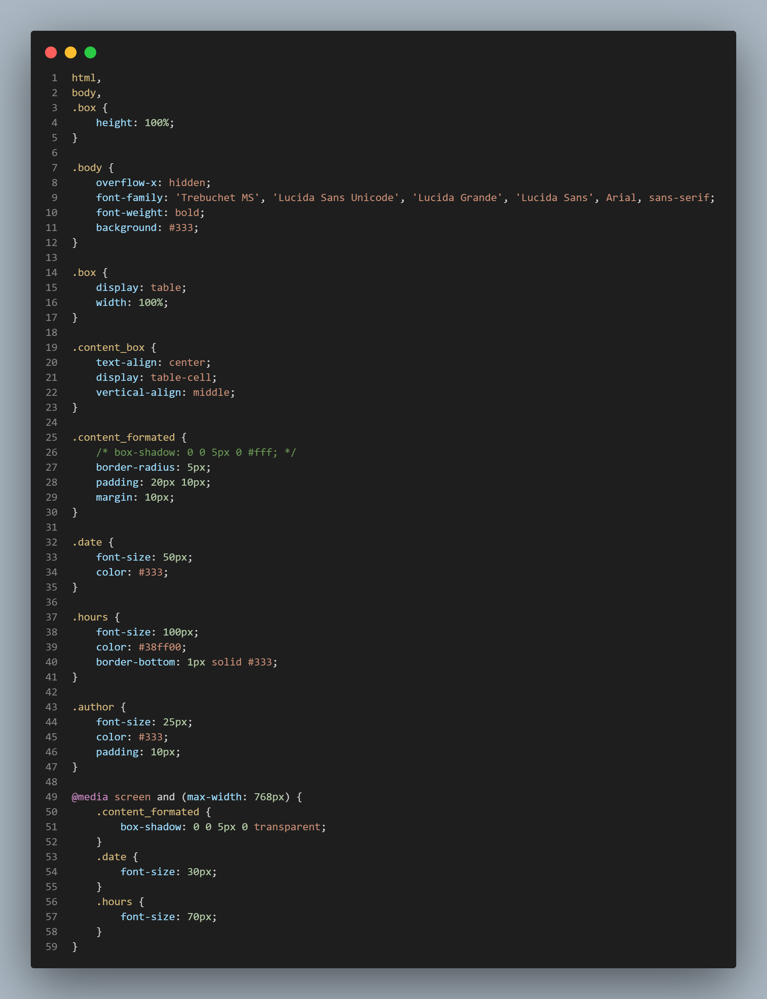
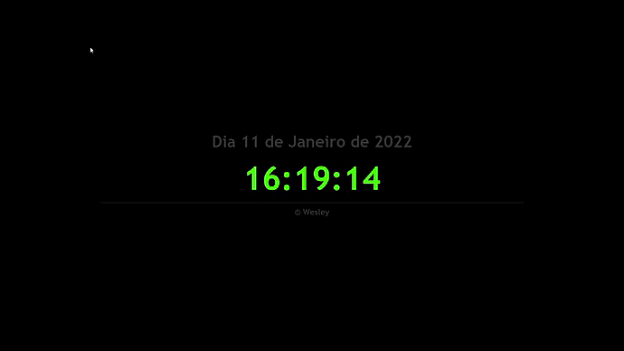

# projetoJS_inst-ncia-Date-
Projeto simples usando o conceito da instância  Date() do JavaScript

Toda exibição a baixo vem direto da instância Date() com a data e hora corrente de acordo com as configurações do sistema.
  
Projeto:
 
<<<<<<< HEAD
Código JavaScript:

 
Código HTML

 
Código CSS

=======

  
Código:
 

>>>>>>> 74d0719affdffce87bba741a3371384df82f9f07

