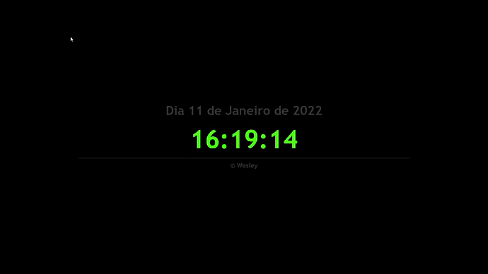
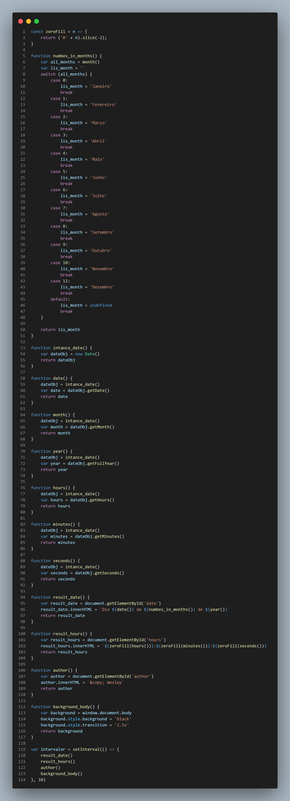
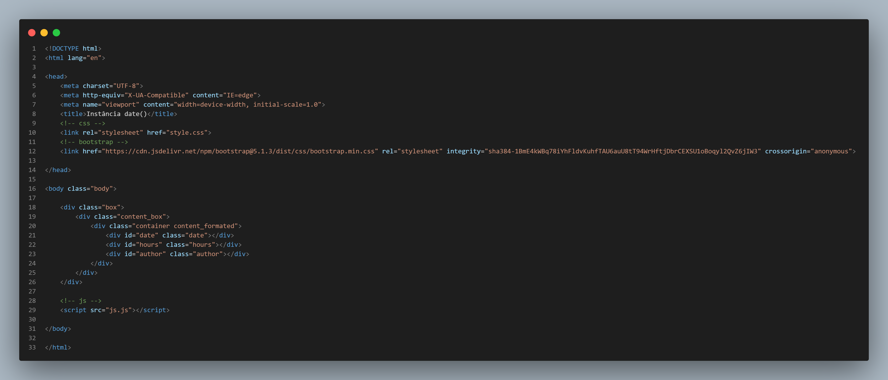
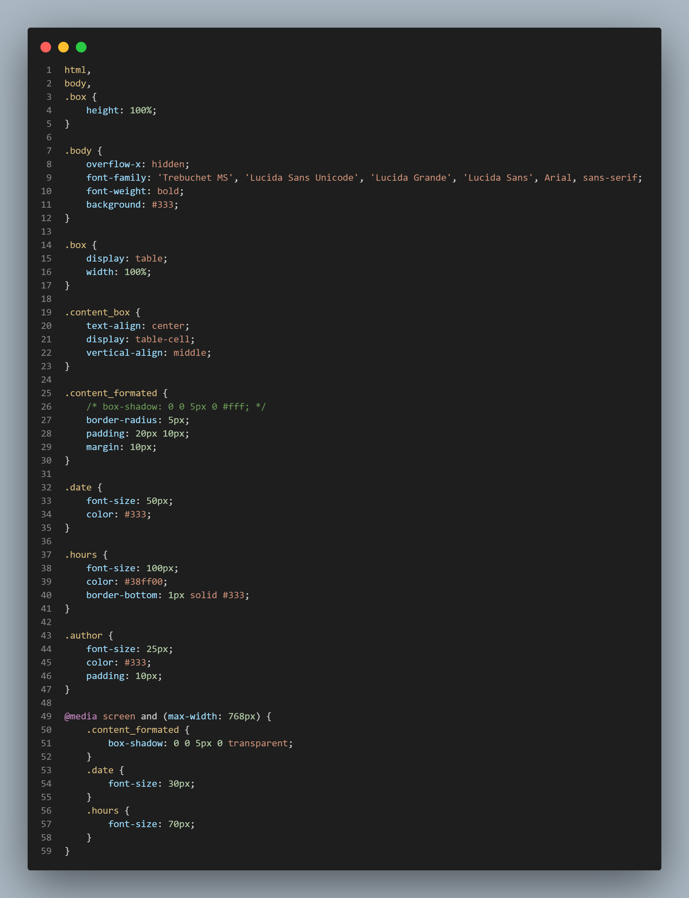

# projetoJS_instancia-Date
Projeto simples usando o conceito da instância  Date() do JavaScript

Toda exibição a baixo vem direto da instância Date() com a data e hora corrente de acordo com as configurações do sistema.
  
Projeto:
 

  
Código JavaScript:

  
Código HTML:
 

  
Código CSS:
 

